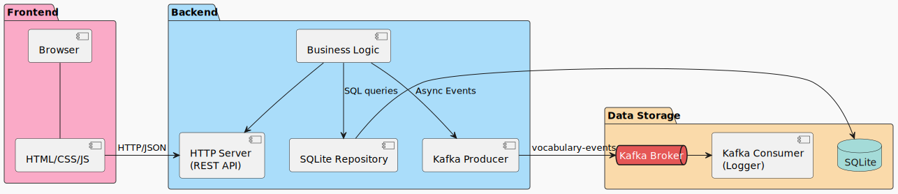

# Software Requirements Specification

## 1. Введение

**Цель проекта**: Создание минималистичного, но функционального веб-приложения для ведения личного словаря русско-японских слов и фраз. Ключевой особенностью является поддержка раздельного внесения чтений кандзи (онъёми и кунъёми). Проект является учебным и нацелен на комплексное освоение стека технологий: Backend (Go), База данных (SQLite), Асинхронная коммуникация (Kafka), Frontend (Ванильный JS) и проектная документация.

**Кодовое название**: `ru-jp-dict`

**Технологический стек**:

| Область | Стек |
| ------- | ---- |
| **Backend** | Golang |
| **Frontend** | HTML5, CSS3, JavaScript |
| **База данных** | SQLite |
| **Брокер сообщений** | Apache Kafka |
| **Контейнеризация** | Docker, Docker Compose |
| **Документация API** | OpenAPI 3.0 |

## 2. Бизнес-Требования (BR)

- **[BR-001] Управление словарным запасом**: Пользователь должен иметь возможность просматривать, добавлять, редактировать и удалять словарные статьи.
- **[BR-002] Учет особенностей японского языка**: Система должна предоставлять отдельные поля для внесения онъёми и кунъёми для корректного отображения различных чтений кандзи.
- **[BR-003] Визуальное различение**: Данные в интерфейсе должны быть визуально разделены по типу чтения с помощью цветовой палитры для быстрого восприятия.
- **[BR-004] История изменений**: Система должна автоматически фиксировать временные метки создания и изменения каждой записи.
- **[BR-005] Асинхронная обработка событий**: Ключевые действия пользователя должны фиксироваться как события для их последующей обработки (логирование, анализ, уведомления) без блокировки основного интерфейса.
- **[BR-006] Минималистичный интерфейс**: Интерфейс должен быть простым, интуитивно понятным и визуально приятным, сфокусированным на контенте.

## 3. Функциональные Требования (FR)

### 3.1. Требования к Frontend

- **[FR-001] Отображение списка слов**: Главная страница приложения должна отображать таблицу со всеми существующими словарными статьями. Таблица должна содержать следующие колонки: ID, Русский, Японский (Кандзи/Кана), Онъёми, Кунъёми, Дата создания, Дата обновления, Действия (Изменить, Удалить).
- **[FR-002] Цветовое кодирование**: Значения в колонках "Онъёми" и "Кунъёми" должны иметь цветной фон для легкой визуальной идентификации.
  - Онъёми: фон #faaac7 (розовый)
  - Кунъёми: фон #a2d2ff (голубой)
- **[FR-003] Модальное окно добавления**: На главной странице должна присутствовать кнопка "Добавить", при нажатии на которую появляется модальное окно с формой для ввода данных новой записи.
- **[FR-004] Модальное окно редактирования**: При нажатии на кнопку "Изменить" в строке таблицы должно открываться модальное окно с формой, предзаполненной данными выбранной записи, для их последующего изменения.
- **[FR-005] Подтверждение удаления**: При нажатии на кнопку "Удалить" должно появляться стандартное браузерное окно подтверждения (`confirm()`).

### 3.2. Требования к Backend

- **[FR-006] RESTful API**: Все операции с данными должны осуществляться через REST API, реализованное на Go.
- **[FR-007] Интеграция с Kafka**: Бэкенд должен отправлять событие в Kafka при каждой успешной операции создания, обновления или удаления словарной статьи.

### 3.3. Требования к данным

- **[FR-008] Валидация данных**: Обязательными для заполнения являются только поля "Русский" и "Японский". Поля "Онъёми" и "Кунъёми" опциональны.

## 4. Нефункциональные Требования (NFR)

- **[NFR-001] Язык backend-разработки**: Golang.
- **[NFR-002] Фронтенд**: Должен быть реализован на ванильном JavaScript, HTML, CSS без использования тяжелых фреймворков.
- **[NFR-003] Хранение данных**: Должна использоваться встраиваемая БД SQLite.
- **[NFR-004] Стилизация**: Интерфейс должен быть реализован в соответствии с предоставленной палитрой (#a2d2ff, #bee2ff, #faaac7, #ffc8dd, #cdb4db, #000000, #ffffff).
- **[NFR-005] Документация**: REST API должно быть полностью описано в файле openapi.yaml в корне проекта.

## 5. Архитектура

### 5.1. Диаграмма компонентов



> Пояснение: Пользователь взаимодействует с Frontend в браузере. Frontend отправляет HTTP-запросы на Backend. Backend обрабатывает логику, сохраняет данные в SQLite и асинхронно отправляет события в Kafka. Отдельный компонент (Kafka Consumer) подписан на эти события и может обрабатывать их (например, логировать в файл).

## 6. Модель данных

### 6.1. ER-диаграмма


### 6.2. Описание таблиц

#### 6.2.1. Vocabulary

| Поле | Тип данных | Ограничения | Описание |
| ---- | ---------- | ----------- | -------- |
| id | INTEGER | PRIMARY KEY, AUTOINCREMENT | Уникальный идентификатор записи. |
| russian | TEXT | NOT NULL | Слово или фраза на русском языке. |
| japanese | TEXT | NOT NULL | Основное написание на японском языке (Кандзи или Кана). |
| onyomi | TEXT | DEFAULT '' | Китайское чтение (онъёми). Может быть пустым. |
| kunyomi | TEXT | DEFAULT '' | Японское чтение (кунъёми). Может быть пустым. |
| created_at | DATETIME | DEFAULT CURRENT_TIMESTAMP | Дата и время создания записи (заполняется автоматически). |
| updated_at | DATETIME | DEFAULT CURRENT_TIMESTAMP | Дата и время последнего обновления записи (заполняется автоматически). |

### 6.3. SQL DDL для создания таблицы

```sql
CREATE TABLE IF NOT EXISTS vocabulary (
    id INTEGER PRIMARY KEY AUTOINCREMENT,
    russian TEXT NOT NULL,
    japanese TEXT NOT NULL,
    onyomi TEXT DEFAULT '',
    kunyomi TEXT DEFAULT '',
    created_at DATETIME DEFAULT CURRENT_TIMESTAMP,
    updated_at DATETIME DEFAULT CURRENT_TIMESTAMP
);
```

## 7. REST API Specification (OpenAPI 3.0)

**Базовый URL**: `http://localhost:8080/api/v1`

Все запросы и ответы используют тип содержимого `application/json`.

### 7.1. Получить все слова

- **Method**: GET
- **Endpoint**: /words
- **Response**: 200 OK

```json
[
  {
    "id": 1,
    "russian": "книга",
    "japanese": "本",
    "onyomi": "ホン",
    "kunyomi": "ほん",
    "created_at": "2023-10-25T10:30:00Z",
    "updated_at": "2023-10-25T10:30:00Z"
  }
]
```

### 7.2. Добавить новое слово

- **Method**: POST
- **Endpoint**: /words
- **Request Body**:

```json
{
  "russian": "книга",
  "japanese": "本",
  "onyomi": "ホン",
  "kunyomi": "ほん"
}
```

- **Response**: 201 Created

```json
{
  "id": 1,
  "message": "Word created successfully"
}
```

### 7.3. Обновить слово

- **Method**: PUT

- **Endpoint**: /words/{id}

- **Request Body**: (Аналогично телу запроса для добавления)

- **Response**: 200 OK

```json
{
  "message": "Word updated successfully"
}
```

### 7.4. Удалить слово

- **Method**: DELETE

- **Endpoint**: /words/{id}

- **Response**: 200 OK

```json
{
  "message": "Word deleted successfully"
}
```

## 8. События Kafka

Бэкенд отправляет события в топик `vocabulary-events`. Схема события:

```json
{
  "type": "object",
  "properties": {
    "event_type": {
      "type": "string",
      "enum": ["word_created", "word_updated", "word_deleted"]
    },
    "payload": {
      "type": "object",
      "properties": {
        "id": { "type": "integer" },
        "russian": { "type": "string" },
        "japanese": { "type": "string" },
        "onyomi": { "type": "string" },
        "kunyomi": { "type": "string" },
        "created_at": { "type": "string", "format": "date-time" },
        "updated_at": { "type": "string", "format": "date-time" }
      },
      "required": ["id"]
    },
    "timestamp": {
      "type": "string",
      "format": "date-time"
    }
  },
  "required": ["event_type", "payload", "timestamp"]
}
```

**Пример события**:

```json
{
  "event_type": "word_created",
  "payload": {
    "id": 42,
    "russian": "огонь",
    "japanese": "火",
    "onyomi": "カ",
    "kunyomi": "ひ"
  },
  "timestamp": "2023-10-25T12:34:56.789Z"
}
```

## 9. Структура репозитория

<!-- ru-jp-dict/                 # Корень проекта (Git Repository)
├── backend/                # Исходный код Go-приложения
│   ├── cmd/
│   │   └── server/
│   │       └── main.go     # Точка входа (функция main)
│   ├── internal/           # Внутренние пакеты, не предназначенные для импорта извне
│   │   ├── config/         # Конфигурация приложения (env, flags)
│   │   ├── database/       # Инициализация и работа с SQLite
│   │   ├── kafka/          # Настройка и утилиты для Kafka Producer
│   │   ├── handlers/       # HTTP-обработчики (роуты /api/v1/...)
│   │   ├── models/         # Go-структуры (Vocabulary, Event)
│   │   └── repository/     # Слой работы с БД (функции Create, Get, Update, Delete)
│   ├── docs/
│   │   └── openapi.yaml    # Полная спецификация API
│   ├── go.mod              # Модуль Go
│   └── go.sum
├── frontend/               # Статические файлы фронтенда
│   ├── index.html
│   ├── style.css           # Все стили с использованием цветовой палитры
│   └── script.js           # Вся логика взаимодействия с API
├── docker-compose.yml      # Конфигурация для запуска Kafka и Zookeeper
├── README.md               # Инструкция по запуску проекта
└── .gitignore -->